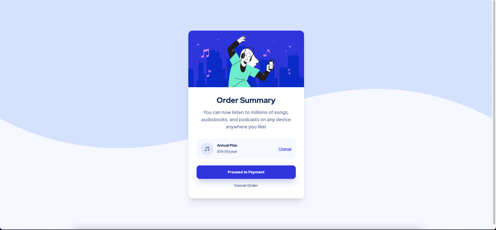

# Frontend Mentor - Order summary card solution

This is a solution to the [Order summary card challenge on Frontend Mentor](https://www.frontendmentor.io/challenges/order-summary-component-QlPmajDUj). Frontend Mentor challenges help you improve your coding skills by building realistic projects. 

## Table of contents

- [Overview](#overview)
  - [Screenshot](#screenshot)
  - [Links](#links)
- [My process](#my-process)
  - [Built with](#built-with)
- [Author](#author)
- [Acknowledgments](#acknowledgments)

## Overview

### Screenshot



### Links

- Solution URL: [(https://github.com/Kofiastro/order-summary-component)]
- Live Site URL:[(https://sensational-tiramisu-f6a9b0.netlify.app/)]

## My process
Using Tailwindcss i have been able to work on designs much faster and i want to learn more by working on more projects at frontendmentor to help me be good at it.

### Built with

- TailwindCss

### What I learned

Fourth Project using TailwindCSS.So far so good.I was faced with no issues. However, i was able to identify how to set background images in tailwindcss using svg's which was really cool and easy to implement.The code Snippet Below shows my approach to adding background images

```html
 <!--Background images-->
 <body class="bg-Very_pale">
  <main class="md:bg-BackDesktop bg-BackMobile bg-no-repeat bg-contain bg-top">
            
```
```js
  /** @type {import('tailwindcss').Config} */
module.exports = {
  content: ['./*.html'],
  theme: {
    extend: {
      backgroundImage:{
        BackMobile:"url('../images/pattern-background-mobile.svg')",
        BackDesktop: "url('../images/pattern-background-desktop.svg')",
      },
    },
  },
  plugins: [],
}

```

## Author

- Frontend Mentor - [@Kofiastro](https://www.frontendmentor.io/profile/kofiastro)

## Acknowledgments

Big thanks to Traversy Media and the frontendmentor team 🎉
